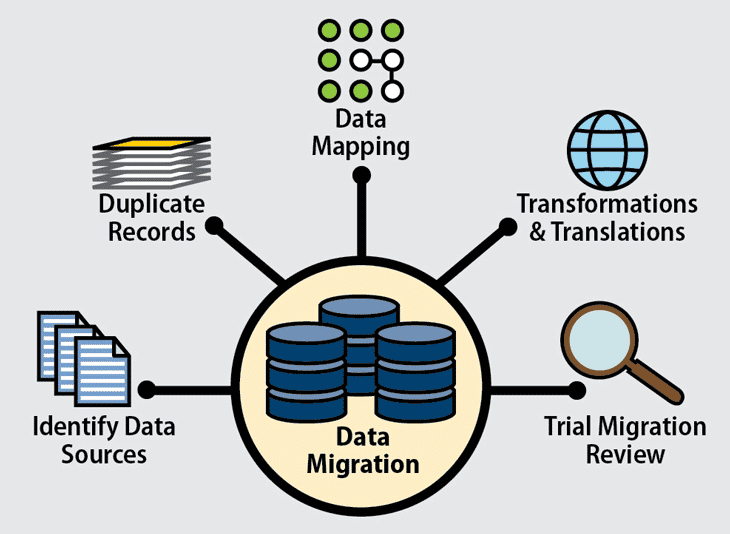

# schema-first

## Schema First

### Introduction

[https://github.com/vietphan1995/schema-first.git](https://github.com/vietphan1995/schema-first.git)

Schema First is a development software which helps people in planning data model schema in script or map drawing.

Schema First can generate to document schema as noSQL, relational data object/table as SQL from data model schema.

Schema First can generate workflow script from data model schema, especially migrates data model and data by workflow/scenario in keeping original prototype design.

### [back to git projects …](https://github.com/vietphan1995/projects)

### Notes
https://phantrungviet.notion.site/schema-first-1a75e832d6ee807cac1bdce8173b3181